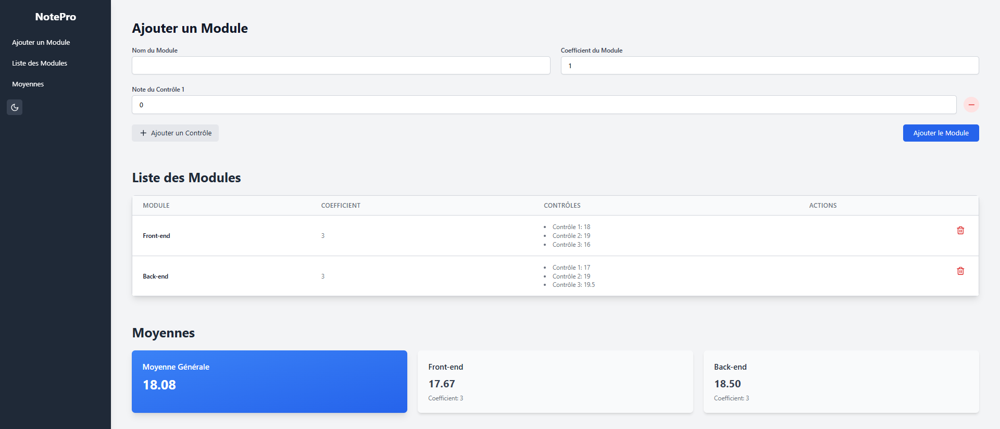

# Note Calculation App

### Une application pour calculer les moyennes des modules

---

## Table des matières

- [Aperçu](#aperçu)
- [Fonctionnalités](#fonctionnalités)
- [Technologies](#technologies)
- [Déploiement](#déploiement)
- [Auteur](#auteur)

---

## Aperçu

**Note Calculation App** est une application simple et moderne qui permet de calculer la moyenne générale d'un étudiant en fonction des modules et des contrôles. L'application offre une interface utilisateur claire et intuitive pour ajouter des modules, saisir les notes des contrôles, et obtenir une moyenne pondérée. Elle prend en charge des fonctionnalités avancées telles que la gestion des modules et des contrôles.

Le projet utilise **React.js** et **Tailwind CSS** pour offrir une expérience utilisateur rapide et fluide. Il est facile à personnaliser et à intégrer dans vos propres projets.

---

## Aperçu visuel

### Desktop View

---

## Fonctionnalités

- **Ajout de modules** : Formulaire pour ajouter des modules avec un nom, un coefficient, et plusieurs contrôles.
- **Calcul des moyennes** :
  - Moyenne par module : La moyenne est calculée en fonction des contrôles d'un module.
  - Moyenne générale : Moyenne pondérée en fonction des coefficients des modules.
- **Gestion des modules** : Visualisez, mettez à jour et supprimez des modules.
- **Responsive design** : L'application est entièrement responsive et s'adapte à tous les appareils (desktop, tablette, mobile).
- **Animations et transitions** : Utilisation de **Framer Motion** pour des animations fluides.

---

## Technologies

- **React.js** : Framework JavaScript pour construire une interface utilisateur dynamique.
- **Tailwind CSS** : Framework CSS utilitaire pour un design rapide et flexible.
- **Framer Motion** : Bibliothèque pour créer des animations modernes et fluides.
- **Redux** : Gestion de l'état global pour une application scalable.
- **React Router** : Gestion de la navigation dans l'application.

---

## Déploiement

L'application est déployée sur [Note Calculation App](https://elgargati.github.io/NotePro/).

---

## Auteur

- **Mohammed El Gargati**
- GitHub : [Elgargati](https://github.com/Elgargati)

---

N'hésitez pas à me contacter si vous avez des questions ou des suggestions !
